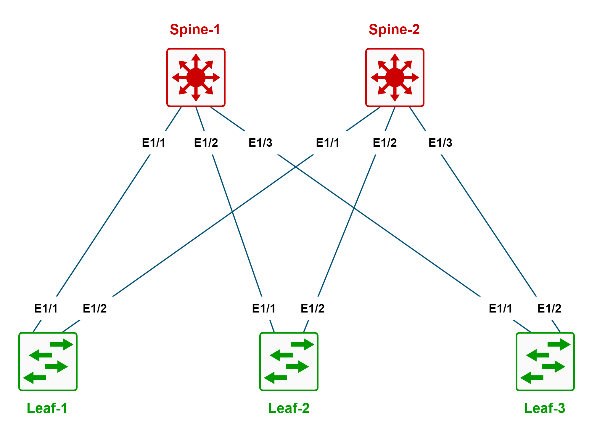
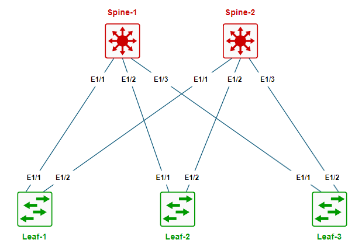
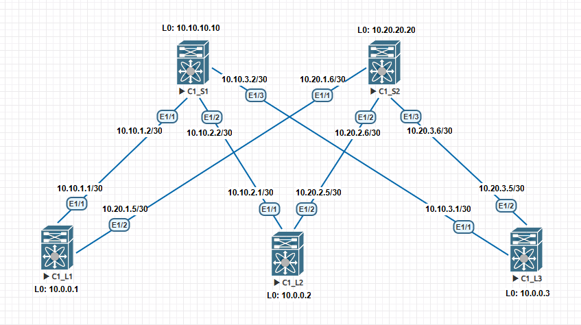

# Проектирование сети, и адресного пространства.

Схема сети, на которой мы будем производить работы.

### 1) Политика наименования устройств SPINE/LEAF.

Наименование устройств производиться по принципу **(площадка с порядковым номером)_(устройство с порядолвым номером)**.

|**Обозначения**|**Расшифровка**|**Пример**|
| ------------- |------------------| -----|
| C     | Площадка ( Цод )    | C1 (Цод1), C2 (Цод2) и т.д |
| S     | Spine |  S1 (Spine1), S2 (Spine2) и т.д  |
| L     | Leaf |   L1 (Leaf1), L2 (Leaf2) и т.д  |

**Пример наименования площадки:**

- С1_S1 - в цоде 1 первый SPINE.
- C2_L1 - в цоде 2 второй LEAF.

### 2) Политика адресации устройств SPINE/LEAF.

> **X.Y.Z.L** - адрес устройства.

**X** - всегда номер цода.

- 10 - первый цод.
- 20 - второй цод.
- 30 - третий цод.

**Y.Z.L** - всегда адрес устройства.

Для Spine: 
- **10.10.10** - первый Spine.
- **20.20.20** - второй Spine.
- **30.30.30** - третий Spine.

Для Leaf:
- **0.0.1** - первый Leaf.
- **0.0.2** - второй Leaf.
- **0.0.3** - третий Leaf.

**Пример адресации устройств:**
- **30.10.10.10** - в цоде 3 первый Spine.
- **10.20.20.20** - в цоде 1 второй Spine.
- **10.0.0.2** - в цоде 1 второй Leaf.
- **20.0.0.3** - в цоде 2 третий Leaf.

### 3) Политика адресации P2P линков.

**X.Y.Z.L** - IP-адрес P2P лика.

- **X** - номер ЦОД.
- **Y** - номер SPINE.
- **Z** - номер LEAF.
- **L** - номер сети.

### 4) Политика подключения Leaf к Spine.
Каждый Leaf, подключает по одному линку к каждому Spine.

Первый Leaf подключаем в первые порты SPINE, второй Leaf подключаем во вторые порты SPINE, и т.д.

*Схема подключения, представлена ниже.*

Итоговая схем после всех настроек.

