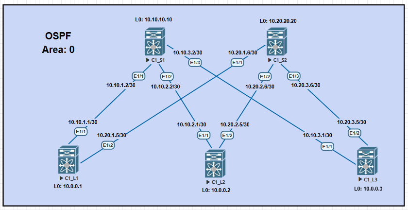

# ДЗ_2. Underlay OSPF
### Цель:
- настроить OSPF для Underlay сети.
- описать.

### Выполнение.

#### 1) Схема сети.



Схему будем собирать на cisco Nexus9000v.
```
C1_S1# show version 

Nexus 9000v is a demo version of the Nexus Operating System

Software
  BIOS: version 
 NXOS: version 9.3(1)
  BIOS compile time:  
  NXOS image file is: bootflash:///nxos.9.3.1.bin
  NXOS compile time:  7/18/2019 15:00:00 [07/19/2019 00:04:48]

Hardware
  cisco Nexus9000 9000v Chassis 
   with 8159828 kB of memory.
  Processor Board ID 9JSBSJSTQXP
```


#### 2) Описание схемы.

- [Описание наименования и выделение адресного пространства, описано в ДЗ_1.](../lab01_architect/README.md)
- Схема особых требований не имеет, поэтому все реализовано в одной Area 0.
- По умолчанию в OSPF включено **passive-interface default**.
- Порты работают в режиме **point-to-point**.
- Включена проверка подлинности соседей.

### Проверка.


**Вывод информации о соседях на Spine1.**

```
C1_S1# show ip ospf neighbors
 OSPF Process ID UNDERLAY VRF default
 Total number of neighbors: 3
 Neighbor ID     Pri State            Up Time  Address         Interface
 10.0.0.1          1 FULL/ -          01:47:08 10.10.1.1       Eth1/1
 10.0.0.2          1 FULL/ -          00:08:51 10.10.2.1       Eth1/2
 10.0.0.3          1 FULL/ -          01:46:27 10.10.3.1       Eth1/3
C1_S1#

```


**Вывод информации о соседях на Spine2**
```
C1_S2# show ip ospf neighbors
 OSPF Process ID UNDERLAY VRF default
 Total number of neighbors: 3
 Neighbor ID     Pri State            Up Time  Address         Interface
 10.0.0.1          1 FULL/ -          01:47:30 10.20.1.5       Eth1/1
 10.0.0.2          1 FULL/ -          00:09:48 10.20.2.5       Eth1/2
 10.0.0.3          1 FULL/ -          01:47:17 10.20.3.5       Eth1/3
C1_S2#
```

**Вывод таблицы маршрутизации OSPF на Spine2.**
```
C1_S2# show ip route ospf-UNDERLAY
10.0.0.1/32, ubest/mbest: 1/0
    *via 10.20.1.5, Eth1/1, [110/41], 01:41:14, ospf-UNDERLAY, intra
10.0.0.2/32, ubest/mbest: 1/0
    *via 10.20.2.5, Eth1/2, [110/41], 00:03:33, ospf-UNDERLAY, intra
10.0.0.3/32, ubest/mbest: 1/0
    *via 10.20.3.5, Eth1/3, [110/41], 01:40:53, ospf-UNDERLAY, intra
10.10.1.0/30, ubest/mbest: 1/0
    *via 10.20.1.5, Eth1/1, [110/80], 01:41:14, ospf-UNDERLAY, intra
10.10.2.0/30, ubest/mbest: 1/0
    *via 10.20.2.5, Eth1/2, [110/80], 00:03:33, ospf-UNDERLAY, intra
10.10.3.0/30, ubest/mbest: 1/0
    *via 10.20.3.5, Eth1/3, [110/80], 01:40:53, ospf-UNDERLAY, intra
10.10.10.10/32, ubest/mbest: 3/0
    *via 10.20.1.5, Eth1/1, [110/81], 01:41:14, ospf-UNDERLAY, intra
    *via 10.20.2.5, Eth1/2, [110/81], 00:03:32, ospf-UNDERLAY, intra
    *via 10.20.3.5, Eth1/3, [110/81], 01:40:53, ospf-UNDERLAY, intra

```

**Проверка доступности Loopback интерфейсов, с Leaf1 до Leaf3.**
```
C1_L1# ping 10.0.0.3
PING 10.0.0.3 (10.0.0.3): 56 data bytes
64 bytes from 10.0.0.3: icmp_seq=0 ttl=253 time=103.157 ms
64 bytes from 10.0.0.3: icmp_seq=1 ttl=253 time=14.162 ms
64 bytes from 10.0.0.3: icmp_seq=2 ttl=253 time=14.327 ms
64 bytes from 10.0.0.3: icmp_seq=3 ttl=253 time=15.46 ms
64 bytes from 10.0.0.3: icmp_seq=4 ttl=253 time=15.476 ms

--- 10.0.0.3 ping statistics ---
5 packets transmitted, 5 packets received, 0.00% packet loss
round-trip min/avg/max = 14.162/32.516/103.157 ms
C1_L1#

```

### Конфигурация оборудования.

#### 1) Конфигурация OSPF.


<details>
<summary>C1_S1# show running-config ospf </summary>

```
version 9.3(1) Bios:version
feature ospf

router ospf UNDERLAY
  router-id 10.10.10.10
  area 0.0.0.0 authentication
  passive-interface default

interface loopback0
  ip router ospf UNDERLAY area 0.0.0.0

interface Ethernet1/1
  ip ospf authentication-key 3 9198394a11c0fa40
  ip ospf network point-to-point
  no ip ospf passive-interface
  ip router ospf UNDERLAY area 0.0.0.0

interface Ethernet1/2
  ip ospf authentication-key 3 9198394a11c0fa40
  ip ospf network point-to-point
  no ip ospf passive-interface
  ip router ospf UNDERLAY area 0.0.0.0

interface Ethernet1/3
  ip ospf authentication-key 3 9198394a11c0fa40
  ip ospf network point-to-point
  no ip ospf passive-interface
  ip router ospf UNDERLAY area 0.0.0.0
```
</details>


<details>
<summary>C1_S2# show running-config ospf </summary>

```
version 9.3(1) Bios:version
feature ospf

router ospf UNDERLAY
  router-id 10.20.20.20
  area 0.0.0.0 authentication
  passive-interface default

interface loopback0
  ip router ospf UNDERLAY area 0.0.0.0

interface Ethernet1/1
  ip ospf authentication-key 3 9198394a11c0fa40
  ip ospf network point-to-point
  no ip ospf passive-interface
  ip router ospf UNDERLAY area 0.0.0.0

interface Ethernet1/2
  ip ospf authentication-key 3 9198394a11c0fa40
  ip ospf network point-to-point
  no ip ospf passive-interface
  ip router ospf UNDERLAY area 0.0.0.0

interface Ethernet1/3
  ip ospf authentication-key 3 9198394a11c0fa40
  ip ospf network point-to-point
  no ip ospf passive-interface
  ip router ospf UNDERLAY area 0.0.0.0

```
</details>


<details>
<summary>C1_L1# show running-config ospf </summary>

```
version 9.3(1) Bios:version
feature ospf

router ospf UNDERLAY
  router-id 10.0.0.1
  area 0.0.0.0 authentication
  passive-interface default

interface loopback0
  ip router ospf UNDERLAY area 0.0.0.0

interface Ethernet1/1
  ip ospf authentication-key 3 9198394a11c0fa40
  ip ospf network point-to-point
  no ip ospf passive-interface
  ip router ospf UNDERLAY area 0.0.0.0

interface Ethernet1/2
  ip ospf authentication-key 3 9198394a11c0fa40
  ip ospf network point-to-point
  no ip ospf passive-interface
  ip router ospf UNDERLAY area 0.0.0.0
```
</details>


<details>
<summary>C1_L2# show running-config ospf </summary>

```
version 9.3(1) Bios:version
feature ospf

router ospf UNDERLAY
  router-id 10.0.0.2
  area 0.0.0.0 authentication
  passive-interface default

interface loopback0
  ip router ospf UNDERLAY area 0.0.0.0

interface Ethernet1/1
  ip ospf authentication-key 3 9198394a11c0fa40
  ip ospf network point-to-point
  no ip ospf passive-interface
  ip router ospf UNDERLAY area 0.0.0.0

interface Ethernet1/2
  ip ospf authentication-key 3 9198394a11c0fa40
  ip ospf network point-to-point
  no ip ospf passive-interface
  ip router ospf UNDERLAY area 0.0.0.0
```
</details>


<details>
<summary>C1_L3# show running-config ospf </summary>

```
version 9.3(1) Bios:version
feature ospf

router ospf UNDERLAY
  router-id 10.0.0.3
  area 0.0.0.0 authentication
  passive-interface default

interface loopback0
  ip router ospf UNDERLAY area 0.0.0.0

interface Ethernet1/1
  ip ospf authentication-key 3 9198394a11c0fa40
  ip ospf network point-to-point
  no ip ospf passive-interface
  ip router ospf UNDERLAY area 0.0.0.0

interface Ethernet1/2
  ip ospf authentication-key 3 9198394a11c0fa40
  ip ospf network point-to-point
  no ip ospf passive-interface
  ip router ospf UNDERLAY area 0.0.0.0
```
</details>


#### 2) Конфигурация коммутаторов.

<details>
<summary>C1_S1# show running-config </summary>

```
version 9.3(1) Bios:version
hostname C1_S1
vdc C1_S1 id 1
  limit-resource vlan minimum 16 maximum 4094
  limit-resource vrf minimum 2 maximum 4096
  limit-resource port-channel minimum 0 maximum 511
  limit-resource u4route-mem minimum 248 maximum 248
  limit-resource u6route-mem minimum 96 maximum 96
  limit-resource m4route-mem minimum 58 maximum 58
  limit-resource m6route-mem minimum 8 maximum 8

feature ospf

no password strength-check
username admin password 5 $5$tq4pb0vW$/DG0d234uGGpzsIgmx.MjjTMPqNu89KbRhTt8T75au
B  role network-admin
ip domain-lookup
copp profile strict
snmp-server user admin network-admin auth md5 0x2e484268d372ddc87ce14d4b17396b07
 priv 0x2e484268d372ddc87ce14d4b17396b07 localizedkey
rmon event 1 description FATAL(1) owner PMON@FATAL
rmon event 2 description CRITICAL(2) owner PMON@CRITICAL
rmon event 3 description ERROR(3) owner PMON@ERROR
rmon event 4 description WARNING(4) owner PMON@WARNING
rmon event 5 description INFORMATION(5) owner PMON@INFO

vlan 1

vrf context management

interface Ethernet1/1
  description connect_to_Leaf1_Eth1/1
  no switchport
  ip address 10.10.1.2/30
  ip ospf authentication-key 3 9198394a11c0fa40
  ip ospf network point-to-point
  no ip ospf passive-interface
  ip router ospf UNDERLAY area 0.0.0.0
  no shutdown

interface Ethernet1/2
  description connect_to_Leaf2_Eth1/1
  no switchport
  ip address 10.10.2.2/30
  ip ospf authentication-key 3 9198394a11c0fa40
  ip ospf network point-to-point
  no ip ospf passive-interface
  ip router ospf UNDERLAY area 0.0.0.0
  no shutdown

interface Ethernet1/3
  description connect_to_Leaf3_Eth1/1
  no switchport
  ip address 10.10.3.2/30
  ip ospf authentication-key 3 9198394a11c0fa40
  ip ospf network point-to-point
  no ip ospf passive-interface
  ip router ospf UNDERLAY area 0.0.0.0
  no shutdown

interface Ethernet1/4

interface Ethernet1/5

interface Ethernet1/6

interface Ethernet1/7

interface Ethernet1/8

interface Ethernet1/9


interface mgmt0
  vrf member management

interface loopback0
  ip address 10.10.10.10/32
  ip router ospf UNDERLAY area 0.0.0.0
line console
line vty
boot nxos bootflash:/nxos.9.3.1.bin
router ospf UNDERLAY
  router-id 10.10.10.10
  area 0.0.0.0 authentication
  passive-interface default

```
</details>


<details>
<summary>C1_S2# show running-config </summary>

```
version 9.3(1) Bios:version
hostname C1_S2
vdc C1_S2 id 1
  limit-resource vlan minimum 16 maximum 4094
  limit-resource vrf minimum 2 maximum 4096
  limit-resource port-channel minimum 0 maximum 511
  limit-resource u4route-mem minimum 248 maximum 248
  limit-resource u6route-mem minimum 96 maximum 96
  limit-resource m4route-mem minimum 58 maximum 58
  limit-resource m6route-mem minimum 8 maximum 8

feature ospf

no password strength-check
username admin password 5 $5$Rjq4phjz$1XEQ2rEISbZ9G8LGghzphLRCJOs2LO6/IRaV3pp6hL
C  role network-admin
ip domain-lookup
copp profile strict
snmp-server user admin network-admin auth md5 0xd9d0f10106d3b13bd21f31069ee73704
 priv 0xd9d0f10106d3b13bd21f31069ee73704 localizedkey
rmon event 1 description FATAL(1) owner PMON@FATAL
rmon event 2 description CRITICAL(2) owner PMON@CRITICAL
rmon event 3 description ERROR(3) owner PMON@ERROR
rmon event 4 description WARNING(4) owner PMON@WARNING
rmon event 5 description INFORMATION(5) owner PMON@INFO

vlan 1

vrf context management

interface Ethernet1/1
  description connect_to_Leaf1_Eth1/2
  no switchport
  ip address 10.20.1.6/30
  ip ospf authentication-key 3 9198394a11c0fa40
  ip ospf network point-to-point
  no ip ospf passive-interface
  ip router ospf UNDERLAY area 0.0.0.0
  no shutdown

interface Ethernet1/2
  description connect_to_Leaf2_Eth1/2
  no switchport
  ip address 10.20.2.6/30
  ip ospf authentication-key 3 9198394a11c0fa40
  ip ospf network point-to-point
  no ip ospf passive-interface
  ip router ospf UNDERLAY area 0.0.0.0
  no shutdown

interface Ethernet1/3
  description connect_to_Leaf3_Eth1/2
  no switchport
  ip address 10.20.3.6/30
  ip ospf authentication-key 3 9198394a11c0fa40
  ip ospf network point-to-point
  no ip ospf passive-interface
  ip router ospf UNDERLAY area 0.0.0.0
  no shutdown

interface Ethernet1/4

interface Ethernet1/5

interface Ethernet1/6

interface Ethernet1/7

interface Ethernet1/8

interface Ethernet1/9


interface mgmt0
  vrf member management

interface loopback0
  ip address 10.20.20.20/32
  ip router ospf UNDERLAY area 0.0.0.0
line console
line vty
boot nxos bootflash:/nxos.9.3.1.bin
router ospf UNDERLAY
  router-id 10.20.20.20
  area 0.0.0.0 authentication
  passive-interface default
```
</details>


<details>
<summary>C1_L1# show running-config </summary>

```
version 9.3(1) Bios:version
hostname C1_L1
vdc C1_L1 id 1
  limit-resource vlan minimum 16 maximum 4094
  limit-resource vrf minimum 2 maximum 4096
  limit-resource port-channel minimum 0 maximum 511
  limit-resource u4route-mem minimum 248 maximum 248
  limit-resource u6route-mem minimum 96 maximum 96
  limit-resource m4route-mem minimum 58 maximum 58
  limit-resource m6route-mem minimum 8 maximum 8

feature ospf

no password strength-check
username admin password 5 $5$r0LmRAS8$E.mbxyMR0Li7JZtpcSB3wXJ5lsykTo/lEp.uyBZoAM
3  role network-admin
ip domain-lookup
copp profile strict
snmp-server user admin network-admin auth md5 0xc322644e77ef11390ea29c93d4b8fe3e
 priv 0xc322644e77ef11390ea29c93d4b8fe3e localizedkey
rmon event 1 description FATAL(1) owner PMON@FATAL
rmon event 2 description CRITICAL(2) owner PMON@CRITICAL
rmon event 3 description ERROR(3) owner PMON@ERROR
rmon event 4 description WARNING(4) owner PMON@WARNING
rmon event 5 description INFORMATION(5) owner PMON@INFO

vlan 1

vrf context management

interface Ethernet1/1
  description connect_to_Spine1_Eth1/1
  no switchport
  ip address 10.10.1.1/30
  ip ospf authentication-key 3 9198394a11c0fa40
  ip ospf network point-to-point
  no ip ospf passive-interface
  ip router ospf UNDERLAY area 0.0.0.0
  no shutdown

interface Ethernet1/2
  description connect_to_Spine2_Eth1/1
  no switchport
  ip address 10.20.1.5/30
  ip ospf authentication-key 3 9198394a11c0fa40
  ip ospf network point-to-point
  no ip ospf passive-interface
  ip router ospf UNDERLAY area 0.0.0.0
  no shutdown

interface Ethernet1/3

interface Ethernet1/4

interface Ethernet1/5

interface Ethernet1/6

interface Ethernet1/7

interface Ethernet1/8

interface Ethernet1/9


interface mgmt0
  vrf member management

interface loopback0
  ip address 10.0.0.1/32
  ip router ospf UNDERLAY area 0.0.0.0
line console
line vty
boot nxos bootflash:/nxos.9.3.1.bin
router ospf UNDERLAY
  router-id 10.0.0.1
  area 0.0.0.0 authentication
  passive-interface default
```
</details>


<details>
<summary>C1_L2# show running-config </summary>

```
version 9.3(1) Bios:version
hostname C1_L2
vdc C1_L2 id 1
  limit-resource vlan minimum 16 maximum 4094
  limit-resource vrf minimum 2 maximum 4096
  limit-resource port-channel minimum 0 maximum 511
  limit-resource u4route-mem minimum 248 maximum 248
  limit-resource u6route-mem minimum 96 maximum 96
  limit-resource m4route-mem minimum 58 maximum 58
  limit-resource m6route-mem minimum 8 maximum 8

feature ospf

username admin password 5 $5$mISsFXNn$jPDzrONWb/Mp9D3C41faSVqat8YJ/J/wj5bUb8uxL1
B  role network-admin
ip domain-lookup
copp profile strict
snmp-server user admin network-admin auth md5 0xd54a1f2887445c005ef792251d139e34
 priv 0xd54a1f2887445c005ef792251d139e34 localizedkey
rmon event 1 description FATAL(1) owner PMON@FATAL
rmon event 2 description CRITICAL(2) owner PMON@CRITICAL
rmon event 3 description ERROR(3) owner PMON@ERROR
rmon event 4 description WARNING(4) owner PMON@WARNING
rmon event 5 description INFORMATION(5) owner PMON@INFO

vlan 1

vrf context management

interface Ethernet1/1
  description connect_to_Spine1_Eth1/2
  no switchport
  ip address 10.10.2.1/30
  ip ospf authentication-key 3 9198394a11c0fa40
  ip ospf network point-to-point
  no ip ospf passive-interface
  ip router ospf UNDERLAY area 0.0.0.0
  no shutdown

interface Ethernet1/2
  description connect_to_Spine2_Eth1/2
  no switchport
  ip address 10.20.2.5/30
  ip ospf authentication-key 3 9198394a11c0fa40
  ip ospf network point-to-point
  no ip ospf passive-interface
  ip router ospf UNDERLAY area 0.0.0.0
  no shutdown

interface Ethernet1/3

interface Ethernet1/4

interface Ethernet1/5

interface Ethernet1/6

interface Ethernet1/7

interface Ethernet1/8

interface Ethernet1/9

interface mgmt0
  vrf member management

interface loopback0
  ip address 10.0.0.2/32
  ip router ospf UNDERLAY area 0.0.0.0
line console
line vty
boot nxos bootflash:/nxos.9.3.1.bin
router ospf UNDERLAY
  router-id 10.0.0.2
  area 0.0.0.0 authentication
  passive-interface default
```
</details>

<details>
<summary>C1_L3# show running-config</summary>

```
version 9.3(1) Bios:version
hostname C1_L3
vdc C1_L3 id 1
  limit-resource vlan minimum 16 maximum 4094
  limit-resource vrf minimum 2 maximum 4096
  limit-resource port-channel minimum 0 maximum 511
  limit-resource u4route-mem minimum 248 maximum 248
  limit-resource u6route-mem minimum 96 maximum 96
  limit-resource m4route-mem minimum 58 maximum 58
  limit-resource m6route-mem minimum 8 maximum 8

feature ospf

username admin password 5 $5$Dj6eq8TH$jiixCK6kyiDMTVyJHagZLFB39MlRFuS3OxwvzbYHVo
6  role network-admin
ip domain-lookup
copp profile strict
snmp-server user admin network-admin auth md5 0x35a767d30e208a7a5532154dad16c1f4
 priv 0x35a767d30e208a7a5532154dad16c1f4 localizedkey
rmon event 1 description FATAL(1) owner PMON@FATAL
rmon event 2 description CRITICAL(2) owner PMON@CRITICAL
rmon event 3 description ERROR(3) owner PMON@ERROR
rmon event 4 description WARNING(4) owner PMON@WARNING
rmon event 5 description INFORMATION(5) owner PMON@INFO

vlan 1

vrf context management

interface Ethernet1/1
  description connect_to_Spine1_Eth1/3
  no switchport
  ip address 10.10.3.1/30
  ip ospf authentication-key 3 9198394a11c0fa40
  ip ospf network point-to-point
  no ip ospf passive-interface
  ip router ospf UNDERLAY area 0.0.0.0
  no shutdown

interface Ethernet1/2
  description connect_to_Spine2_Eth1/3
  no switchport
  ip address 10.20.3.5/30
  ip ospf authentication-key 3 9198394a11c0fa40
  ip ospf network point-to-point
  no ip ospf passive-interface
  ip router ospf UNDERLAY area 0.0.0.0
  no shutdown

interface Ethernet1/3

interface Ethernet1/4

interface Ethernet1/5

interface Ethernet1/6

interface Ethernet1/7

interface Ethernet1/8

interface Ethernet1/9


interface mgmt0
  vrf member management

interface loopback0
  ip address 10.0.0.3/32
  ip router ospf UNDERLAY area 0.0.0.0
line console
line vty
boot nxos bootflash:/nxos.9.3.1.bin
router ospf UNDERLAY
  router-id 10.0.0.3
  area 0.0.0.0 authentication
  passive-interface default

```
</details>


### Дополнительная информация.
---------------------------------------
- [Cisco Nexus 9000 Series NX-OS Routing Configuration Guide](https://www.cisco.com/c/en/us/td/docs/switches/datacenter/nexus9000/sw/93x/unicast/configuration/guide/b-cisco-nexus-9000-series-nx-os-unicast-routing-configuration-guide-93x/b-cisco-nexus-9000-series-nx-os-unicast-routing-configuration-guide-93x_chapter_011011.html)