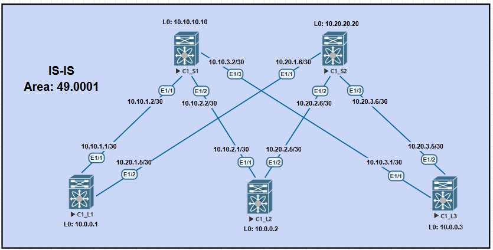

# ДЗ_3. Underlay IS-IS
### Цель:
- настроить IS-IS для Underlay сети.
- описать.

### Выполнение.

#### 1) Схема сети.



Схему будем собирать на cisco Nexus9000v.
```
C1_S1# show version 

Nexus 9000v is a demo version of the Nexus Operating System

Software
  BIOS: version 
 NXOS: version 9.3(1)
  BIOS compile time:  
  NXOS image file is: bootflash:///nxos.9.3.1.bin
  NXOS compile time:  7/18/2019 15:00:00 [07/19/2019 00:04:48]

Hardware
  cisco Nexus9000 9000v Chassis 
   with 8159828 kB of memory.
  Processor Board ID 9JSBSJSTQXP
```


#### 2) Описание схемы.

- [Описание наименования и выделение адресного пространства, описано в ДЗ_1.](../lab01_architect/README.md)
- Схема особых требований не имеет, поэтому все реализовано в одной Area 1.
- Маршрутизацию будем использовать **L1/L2**.
- По умолчанию в IS-IS включено **passive-interface default**.
- Порты работают в режиме **point-to-point**.

### Проверка.


**Вывод информации о соседях на Spine1.**
```
C1_S1# show isis UNDERLAY adjacency 
IS-IS process: UNDERLAY VRF: default
IS-IS adjacency database:
System ID       SNPA            Level  State  Hold Time  Interface
C1_L1           N/A             1-2    UP     00:00:29   Ethernet1/1
C1_L2           N/A             1-2    UP     00:00:30   Ethernet1/2
C1_L3           N/A             1-2    UP     00:00:26   Ethernet1/3
C1_S1#
```


**Вывод информации о соседях на Spine2**
```
C1_S2# show isis UNDERLAY adjacency
IS-IS process: UNDERLAY VRF: default
IS-IS adjacency database:
System ID       SNPA            Level  State  Hold Time  Interface
C1_L1           N/A             1-2    UP     00:00:25   Ethernet1/1
C1_L2           N/A             1-2    UP     00:00:26   Ethernet1/2
C1_L3           N/A             1-2    UP     00:00:22   Ethernet1/3
C1_S2#
```

**Вывод информации ISIS на интерфейсах Spine1.**
```
C1_S1# show isis UNDERLAY interface brief 
IS-IS process: UNDERLAY VRF: default
Interface    Type  Idx State        Circuit   MTU  Metric  Priority  Adjs/AdjsUp
                                                   L1  L2  L1  L2    L1    L2  
--------------------------------------------------------------------------------
Topology: TopoID: 0
loopback0    Loop  1     Up/Ready   0x01/L1-2 1500 1   1   64  64    0/0   0/0 
Topology: TopoID: 0
Ethernet1/1  P2P   4     Up/Ready   0x01/L1-2 1500 40  40  64  64    1/1   1/1 
Topology: TopoID: 0
Ethernet1/2  P2P   3     Up/Ready   0x01/L1-2 1500 40  40  64  64    1/1   1/1 
Topology: TopoID: 0
Ethernet1/3  P2P   2     Up/Ready   0x01/L1-2 1500 40  40  64  64    1/1   1/1 

C1_S1# 
```


**Вывод таблицы маршрутизации OSPF на Spine2.**
```
C1_S1# show ip route isis-UNDERLAY 
IP Route Table for VRF "default"
10.0.0.1/32, ubest/mbest: 1/0
    *via 10.10.1.1, Eth1/1, [115/41], 02:01:57, isis-UNDERLAY, L1
10.0.0.2/32, ubest/mbest: 1/0
    *via 10.10.2.1, Eth1/2, [115/41], 01:30:45, isis-UNDERLAY, L1
10.0.0.3/32, ubest/mbest: 1/0
    *via 10.10.3.1, Eth1/3, [115/41], 02:01:54, isis-UNDERLAY, L1
10.20.1.4/30, ubest/mbest: 1/0
    *via 10.10.1.1, Eth1/1, [115/80], 02:01:57, isis-UNDERLAY, L1
10.20.2.4/30, ubest/mbest: 1/0
    *via 10.10.2.1, Eth1/2, [115/80], 01:30:45, isis-UNDERLAY, L1
10.20.3.4/30, ubest/mbest: 1/0
    *via 10.10.3.1, Eth1/3, [115/80], 02:01:54, isis-UNDERLAY, L1
10.20.20.20/32, ubest/mbest: 3/0
    *via 10.10.1.1, Eth1/1, [115/81], 01:19:00, isis-UNDERLAY, L1
    *via 10.10.2.1, Eth1/2, [115/81], 01:18:51, isis-UNDERLAY, L1
    *via 10.10.3.1, Eth1/3, [115/81], 01:18:44, isis-UNDERLAY, L1
```


**Проверка доступности Loopback интерфейсов, с Leaf1 до Leaf3.**
```
C1_L1# ping 10.0.0.3
PING 10.0.0.3 (10.0.0.3): 56 data bytes
64 bytes from 10.0.0.3: icmp_seq=0 ttl=253 time=14.647 ms
64 bytes from 10.0.0.3: icmp_seq=1 ttl=253 time=15.08 ms
64 bytes from 10.0.0.3: icmp_seq=2 ttl=253 time=13.878 ms
64 bytes from 10.0.0.3: icmp_seq=3 ttl=253 time=12.374 ms
64 bytes from 10.0.0.3: icmp_seq=4 ttl=253 time=14.582 ms

--- 10.0.0.3 ping statistics ---
5 packets transmitted, 5 packets received, 0.00% packet loss
round-trip min/avg/max = 12.374/14.112/15.08 ms
C1_L1# 
```

### Конфигурация оборудования.

#### 1) Конфигурация IS-IS.


<details>
<summary>C1_S1# show running-config isis </summary>

```
version 9.3(1) Bios:version  
feature isis

router isis UNDERLAY
  net 49.0001.0010.0010.0010.0010.00
  log-adjacency-changes
  address-family ipv4 unicast
    router-id 10.10.10.10
  passive-interface default level-1-2

interface loopback0
  ip router isis UNDERLAY
  no isis passive-interface level-1-2

interface Ethernet1/1
  isis network point-to-point
  ip router isis UNDERLAY
  no isis passive-interface level-1-2

interface Ethernet1/2
  isis network point-to-point
  ip router isis UNDERLAY
  no isis passive-interface level-1-2

interface Ethernet1/3
  isis network point-to-point
  ip router isis UNDERLAY
  no isis passive-interface level-1-2

```
</details>


<details>
<summary>C1_S2# show running-config isis </summary>

```
version 9.3(1) Bios:version  
feature isis

router isis UNDERLAY
  net 49.0001.0010.0020.0020.0020.00
  log-adjacency-changes
  address-family ipv4 unicast
    router-id 10.20.20.20
  passive-interface default level-1-2

interface loopback0
  ip router isis UNDERLAY
  no isis passive-interface level-1-2

interface Ethernet1/1
  isis network point-to-point
  ip router isis UNDERLAY
  no isis passive-interface level-1-2

interface Ethernet1/2
  isis network point-to-point
  ip router isis UNDERLAY
  no isis passive-interface level-1-2

interface Ethernet1/3
  isis network point-to-point
  ip router isis UNDERLAY
  no isis passive-interface level-1-2
```
</details>


<details>
<summary>C1_L1# show running-config isis </summary>

```
version 9.3(1) Bios:version  
feature isis

router isis UNDERLAY
  net 49.0001.0010.0000.0000.0001.00
  log-adjacency-changes
  address-family ipv4 unicast
    router-id 10.0.0.1
  passive-interface default level-1-2

interface loopback0
  ip router isis UNDERLAY
  no isis passive-interface level-1-2

interface Ethernet1/1
  isis network point-to-point
  ip router isis UNDERLAY
  no isis passive-interface level-1-2

interface Ethernet1/2
  isis network point-to-point
  ip router isis UNDERLAY
  no isis passive-interface level-1-2
```
</details>


<details>
<summary>C1_L2# show running-config isis </summary>

```
version 9.3(1) Bios:version  
feature isis

router isis UNDERLAY
  net 49.0001.0010.0000.0000.0002.00
  log-adjacency-changes
  address-family ipv4 unicast
    router-id 10.0.0.2
  passive-interface default level-1-2

interface loopback0
  ip router isis UNDERLAY
  no isis passive-interface level-1-2

interface Ethernet1/1
  isis network point-to-point
  ip router isis UNDERLAY
  no isis passive-interface level-1-2

interface Ethernet1/2
  isis network point-to-point
  ip router isis UNDERLAY
  no isis passive-interface level-1-2

```
</details>


<details>
<summary>C1_L3# show running-config isis </summary>

```
version 9.3(1) Bios:version  
feature isis

router isis UNDERLAY
  net 49.0001.0010.0000.0000.0003.00
  log-adjacency-changes
  address-family ipv4 unicast
    router-id 10.0.0.3
  passive-interface default level-1-2

interface loopback0
  ip router isis UNDERLAY
  no isis passive-interface level-1-2

interface Ethernet1/1
  isis network point-to-point
  ip router isis UNDERLAY
  no isis passive-interface level-1-2

interface Ethernet1/2
  isis network point-to-point
  ip router isis UNDERLAY
  no isis passive-interface level-1-2
```
</details>


#### 2) Конфигурация коммутаторов.

<details>
<summary>C1_S1# show running-config </summary>

```
version 9.3(1) Bios:version  
hostname C1_S1

vdc C1_S1 id 1
  limit-resource vlan minimum 16 maximum 4094
  limit-resource vrf minimum 2 maximum 4096
  limit-resource port-channel minimum 0 maximum 511
  limit-resource u4route-mem minimum 248 maximum 248
  limit-resource u6route-mem minimum 96 maximum 96
  limit-resource m4route-mem minimum 58 maximum 58
  limit-resource m6route-mem minimum 8 maximum 8

feature isis

no password strength-check
username admin password 5 $5$sFndB6Pv$7Auql25he.R9FuhvEQnkDIP/hQN9XR6EUqkPxaeSir
.  role network-admin
ip domain-lookup
copp profile strict
snmp-server user admin network-admin auth md5 0xfcf717a92da90656207af147ee25c84d
 priv 0xfcf717a92da90656207af147ee25c84d localizedkey
rmon event 1 description FATAL(1) owner PMON@FATAL
rmon event 2 description CRITICAL(2) owner PMON@CRITICAL
rmon event 3 description ERROR(3) owner PMON@ERROR
rmon event 4 description WARNING(4) owner PMON@WARNING
rmon event 5 description INFORMATION(5) owner PMON@INFO

vlan 1

vrf context management

interface Ethernet1/1
  description connect_to_Leaf1_Eth1/1
  no switchport
  ip address 10.10.1.2/30
  isis network point-to-point
  ip router isis UNDERLAY
  no isis passive-interface level-1-2
  no shutdown

interface Ethernet1/2
  description connect_to_Leaf2_Eth1/1
  no switchport
  ip address 10.10.2.2/30
  isis network point-to-point
  ip router isis UNDERLAY
  no isis passive-interface level-1-2
  no shutdown

interface Ethernet1/3
  description connect_to_Leaf3_Eth1/1
  no switchport
  ip address 10.10.3.2/30
  isis network point-to-point
  ip router isis UNDERLAY
  no isis passive-interface level-1-2
  no shutdown

interface Ethernet1/4

interface Ethernet1/5

interface Ethernet1/6

interface Ethernet1/7

interface Ethernet1/8

interface Ethernet1/9

interface mgmt0
  vrf member management

interface loopback0
  ip address 10.10.10.10/32
  ip router isis UNDERLAY
  no isis passive-interface level-1-2
line console
line vty
boot nxos bootflash:/nxos.9.3.1.bin 
router isis UNDERLAY
  net 49.0001.0010.0010.0010.0010.00
  log-adjacency-changes
  address-family ipv4 unicast
    router-id 10.10.10.10
  passive-interface default level-1-2
```
</details>


<details>
<summary>C1_S2# show running-config </summary>

```
version 9.3(1) Bios:version  
hostname C1_S2

vdc C1_S2 id 1
  limit-resource vlan minimum 16 maximum 4094
  limit-resource vrf minimum 2 maximum 4096
  limit-resource port-channel minimum 0 maximum 511
  limit-resource u4route-mem minimum 248 maximum 248
  limit-resource u6route-mem minimum 96 maximum 96
  limit-resource m4route-mem minimum 58 maximum 58
  limit-resource m6route-mem minimum 8 maximum 8

feature isis

no password strength-check
username admin password 5 $5$zrd1PGqa$b2XadDYCNMBjvJc2fMwEoPgMyZwi8HKi32etx1wu3/
D  role network-admin
ip domain-lookup
copp profile strict
snmp-server user admin network-admin auth md5 0x18a3b2cb453b00606aa939594d64bd84
 priv 0x18a3b2cb453b00606aa939594d64bd84 localizedkey
rmon event 1 description FATAL(1) owner PMON@FATAL
rmon event 2 description CRITICAL(2) owner PMON@CRITICAL
rmon event 3 description ERROR(3) owner PMON@ERROR
rmon event 4 description WARNING(4) owner PMON@WARNING
rmon event 5 description INFORMATION(5) owner PMON@INFO

vlan 1

vrf context management

interface Ethernet1/1
  description connect_to_Leaf1_Eth1/2
  no switchport
  ip address 10.20.1.6/30
  isis network point-to-point
  ip router isis UNDERLAY
  no isis passive-interface level-1-2
  no shutdown

interface Ethernet1/2
  description connect_to_Leaf2_Eth1/2
  no switchport
  ip address 10.20.2.6/30
  isis network point-to-point
  ip router isis UNDERLAY
  no isis passive-interface level-1-2
  no shutdown

interface Ethernet1/3
  description connect_to_Leaf3_Eth1/2
  no switchport
  ip address 10.20.3.6/30
  isis network point-to-point
  ip router isis UNDERLAY
  no isis passive-interface level-1-2
  no shutdown

interface Ethernet1/4

interface Ethernet1/5

interface Ethernet1/6

interface Ethernet1/7

interface Ethernet1/8

interface Ethernet1/9

interface mgmt0
  vrf member management

interface loopback0
  ip address 10.20.20.20/32
  ip router isis UNDERLAY
  no isis passive-interface level-1-2
line console
line vty
boot nxos bootflash:/nxos.9.3.1.bin 
router isis UNDERLAY
  net 49.0001.0010.0020.0020.0020.00
  log-adjacency-changes
  address-family ipv4 unicast
    router-id 10.20.20.20
  passive-interface default level-1-2
```
</details>


<details>
<summary>C1_L1# show running-config </summary>

```
version 9.3(1) Bios:version  
hostname C1_L1

vdc C1_L1 id 1
  limit-resource vlan minimum 16 maximum 4094
  limit-resource vrf minimum 2 maximum 4096
  limit-resource port-channel minimum 0 maximum 511
  limit-resource u4route-mem minimum 248 maximum 248
  limit-resource u6route-mem minimum 96 maximum 96
  limit-resource m4route-mem minimum 58 maximum 58
  limit-resource m6route-mem minimum 8 maximum 8

feature isis

no password strength-check
username admin password 5 $5$a64.g0qy$fwgL2wFQHSPHaVcbuiIKBYelXs41Ig9eR/T/Tmpzm3
3  role network-admin
ip domain-lookup
copp profile strict
snmp-server user admin network-admin auth md5 0x48954f2404a24b617e6002910f16745f
 priv 0x48954f2404a24b617e6002910f16745f localizedkey
rmon event 1 description FATAL(1) owner PMON@FATAL
rmon event 2 description CRITICAL(2) owner PMON@CRITICAL
rmon event 3 description ERROR(3) owner PMON@ERROR
rmon event 4 description WARNING(4) owner PMON@WARNING
rmon event 5 description INFORMATION(5) owner PMON@INFO

vlan 1

vrf context management

interface Ethernet1/1
  description connect_to_Spine1_Eth1/1
  no switchport
  ip address 10.10.1.1/30
  isis network point-to-point
  ip router isis UNDERLAY
  no isis passive-interface level-1-2
  no shutdown

interface Ethernet1/2
  description connect_to_Spine2_Eth1/1
  no switchport
  ip address 10.20.1.5/30
  isis network point-to-point
  ip router isis UNDERLAY
  no isis passive-interface level-1-2
  no shutdown

interface Ethernet1/3

interface Ethernet1/4

interface Ethernet1/5

interface Ethernet1/6

interface Ethernet1/7

interface Ethernet1/8

interface Ethernet1/9

interface mgmt0
  vrf member management

interface loopback0
  ip address 10.0.0.1/32
  ip router isis UNDERLAY
  no isis passive-interface level-1-2
line console
line vty
boot nxos bootflash:/nxos.9.3.1.bin 
router isis UNDERLAY
  net 49.0001.0010.0000.0000.0001.00
  log-adjacency-changes
  address-family ipv4 unicast
    router-id 10.0.0.1
  passive-interface default level-1-2
```
</details>


<details>
<summary>C1_L2# show running-config </summary>

```
version 9.3(1) Bios:version  
hostname C1_L2

vdc C1_L2 id 1
  limit-resource vlan minimum 16 maximum 4094
  limit-resource vrf minimum 2 maximum 4096
  limit-resource port-channel minimum 0 maximum 511
  limit-resource u4route-mem minimum 248 maximum 248
  limit-resource u6route-mem minimum 96 maximum 96
  limit-resource m4route-mem minimum 58 maximum 58
  limit-resource m6route-mem minimum 8 maximum 8

feature isis

username admin password 5 $5$l3l1B6LW$gPUTjIIITLTO.Et1CUUqRmkdrTkdfVQcF2Sglom5BO
2  role network-admin
ip domain-lookup
copp profile strict
snmp-server user admin network-admin auth md5 0xef7b8e1600167b9b56981632125e3b0c
 priv 0xef7b8e1600167b9b56981632125e3b0c localizedkey
rmon event 1 description FATAL(1) owner PMON@FATAL
rmon event 2 description CRITICAL(2) owner PMON@CRITICAL
rmon event 3 description ERROR(3) owner PMON@ERROR
rmon event 4 description WARNING(4) owner PMON@WARNING
rmon event 5 description INFORMATION(5) owner PMON@INFO

vlan 1

vrf context management

interface Ethernet1/1
  description connect_to_Spine1_Eth1/2
  no switchport
  ip address 10.10.2.1/30
  isis network point-to-point
  ip router isis UNDERLAY
  no isis passive-interface level-1-2
  no shutdown

interface Ethernet1/2
  description connect_to_Spine2_Eth1/2
  no switchport
  ip address 10.20.2.5/30
  isis network point-to-point
  ip router isis UNDERLAY
  no isis passive-interface level-1-2
  no shutdown

interface Ethernet1/3

interface Ethernet1/4

interface Ethernet1/5

interface Ethernet1/6

interface Ethernet1/7

interface Ethernet1/8

interface Ethernet1/9

interface mgmt0
  vrf member management

interface loopback0
  ip address 10.0.0.2/32
  ip router isis UNDERLAY
  no isis passive-interface level-1-2
line console
line vty
boot nxos bootflash:/nxos.9.3.1.bin 
router isis UNDERLAY
  net 49.0001.0010.0000.0000.0002.00
  log-adjacency-changes
  address-family ipv4 unicast
    router-id 10.0.0.2
  passive-interface default level-1-2
```
</details>

<details>
<summary>C1_L3# show running-config</summary>

```
version 9.3(1) Bios:version  
hostname C1_L3

vdc C1_L3 id 1
  limit-resource vlan minimum 16 maximum 4094
  limit-resource vrf minimum 2 maximum 4096
  limit-resource port-channel minimum 0 maximum 511
  limit-resource u4route-mem minimum 248 maximum 248
  limit-resource u6route-mem minimum 96 maximum 96
  limit-resource m4route-mem minimum 58 maximum 58
  limit-resource m6route-mem minimum 8 maximum 8

feature isis

no password strength-check
username admin password 5 $5$HtDeAH5E$rTV9NcBShGgBTZVA9k..3nwHXs/ABInJ6SdCu6Nof6
2  role network-admin
ip domain-lookup
copp profile strict
snmp-server user admin network-admin auth md5 0x597338a85ddcfa516dc8f05d0dbbf652
 priv 0x597338a85ddcfa516dc8f05d0dbbf652 localizedkey
rmon event 1 description FATAL(1) owner PMON@FATAL
rmon event 2 description CRITICAL(2) owner PMON@CRITICAL
rmon event 3 description ERROR(3) owner PMON@ERROR
rmon event 4 description WARNING(4) owner PMON@WARNING
rmon event 5 description INFORMATION(5) owner PMON@INFO

vlan 1

vrf context management

interface Ethernet1/1
  description connect_to_Spine1_Eth1/3
  no switchport
  ip address 10.10.3.1/30
  isis network point-to-point
  ip router isis UNDERLAY
  no isis passive-interface level-1-2
  no shutdown

interface Ethernet1/2
  description connect_to_Spine2_Eth1/3
  no switchport
  ip address 10.20.3.5/30
  isis network point-to-point
  ip router isis UNDERLAY
  no isis passive-interface level-1-2
  no shutdown

interface Ethernet1/3

interface Ethernet1/4

interface Ethernet1/5

interface Ethernet1/6

interface Ethernet1/7

interface Ethernet1/8

interface Ethernet1/9

interface mgmt0
  vrf member management

interface loopback0
  ip address 10.0.0.3/32
  ip router isis UNDERLAY
  no isis passive-interface level-1-2
line console
line vty
boot nxos bootflash:/nxos.9.3.1.bin 
router isis UNDERLAY
  net 49.0001.0010.0000.0000.0003.00
  log-adjacency-changes
  address-family ipv4 unicast
    router-id 10.0.0.3
  passive-interface default level-1-2

```
</details>

### Дополнительная информация.
---------------------------------------
- [Cisco Nexus 9000 Series NX-OS Routing Configuration Guide](https://www.cisco.com/c/en/us/td/docs/switches/datacenter/nexus9000/sw/93x/unicast/configuration/guide/b-cisco-nexus-9000-series-nx-os-unicast-routing-configuration-guide-93x/b-cisco-nexus-9000-series-nx-os-unicast-routing-configuration-guide-93x_chapter_011100.html)