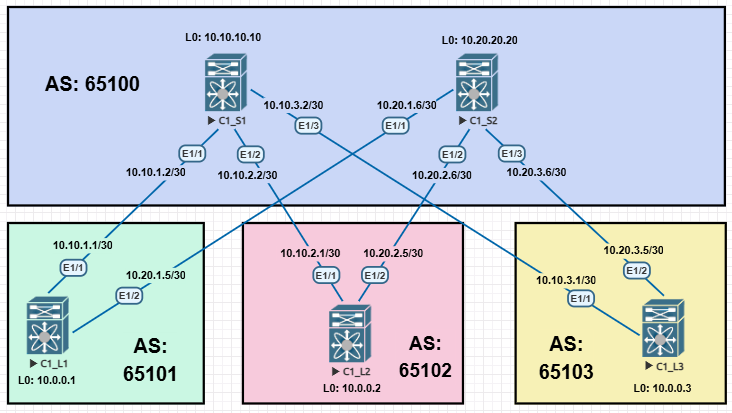

# ДЗ_4. Underlay eBGP.
### Цель:
- настроить eBGP для Underlay сети.
- описать.

### Выполнение.

#### 1) Схема сети.



Схему будем собирать на cisco Nexus9000v.
```
C1_S1# show version 

Nexus 9000v is a demo version of the Nexus Operating System

Software
  BIOS: version 
 NXOS: version 9.2(4)
  BIOS compile time:  
  NXOS image file is: bootflash:///nxos.9.2.4.bin
  NXOS compile time:  8/20/2019 7:00:00 [08/20/2019 15:52:22]


Hardware
  cisco Nexus9000 9000v Chassis 
   with 8160188 kB of memory.
  Processor Board ID 92NPX2GA1FH
```


#### 2) Описание схемы.

- [Описание наименования и выделение адресного пространства, описано в ДЗ_1.](../lab01_architect/README.md)
- Схему будем реализовывать через **eBGP**.
- Настройку BGP будем делать не попростому в лоб, а как учил мэтр через **template peer**.
- Каждый коммутатор будет анонсировать свой Loopback0.

### Проверка.


**Вывод информации о состояние соседства на Spine1.**

```
C1_S1# show ip bgp summary 
BGP summary information for VRF default, address family IPv4 Unicast
BGP router identifier 10.10.10.10, local AS number 65100
BGP table version is 8, IPv4 Unicast config peers 4, capable peers 3
4 network entries and 4 paths using 896 bytes of memory
BGP attribute entries [4/656], BGP AS path entries [3/18]
BGP community entries [0/0], BGP clusterlist entries [0/0]

Neighbor        V    AS MsgRcvd MsgSent   TblVer  InQ OutQ Up/Down  State/PfxRcd
10.10.1.1       4 65101     750     748        8    0    0 00:37:16 1         
10.10.2.1       4 65102     755     753        8    0    0 00:37:30 1         
10.10.3.1       4 65103     752     751        8    0    0 00:37:19 1         
```


**Вывод информации о состояние соседства на Spine2.**
```
C1_S2# show ip bgp summary 
BGP summary information for VRF default, address family IPv4 Unicast
BGP router identifier 10.20.20.20, local AS number 65100
BGP table version is 6, IPv4 Unicast config peers 4, capable peers 3
4 network entries and 4 paths using 896 bytes of memory
BGP attribute entries [4/656], BGP AS path entries [3/18]
BGP community entries [0/0], BGP clusterlist entries [0/0]

Neighbor        V    AS MsgRcvd MsgSent   TblVer  InQ OutQ Up/Down  State/PfxRcd
10.20.1.5       4 65101     516     515        6    0    0 00:25:34 1         
10.20.2.5       4 65102     517     515        6    0    0 00:25:34 1         
10.20.3.5       4 65103     516     515        6    0    0 00:25:33 1      
```

**Вывод информации о состояние соседства на Leaf1.**
```
C1_L1# show ip bgp summary 
BGP summary information for VRF default, address family IPv4 Unicast
BGP router identifier 10.0.0.1, local AS number 65101
BGP table version is 10, IPv4 Unicast config peers 2, capable peers 2
5 network entries and 7 paths using 1368 bytes of memory
BGP attribute entries [4/656], BGP AS path entries [3/26]
BGP community entries [0/0], BGP clusterlist entries [0/0]

Neighbor        V    AS MsgRcvd MsgSent   TblVer  InQ OutQ Up/Down  State/PfxRcd
10.10.1.2       4 65100     867     864       10    0    0 00:43:02 3         
10.20.1.6       4 65100     569     567       10    0    0 00:28:08 3         

```


**Вывод таблицы маршрутизации BGP на Spine1.**
```
C1_S1# show ip route bgp-65100 
IP Route Table for VRF "default"
'*' denotes best ucast next-hop
'**' denotes best mcast next-hop
'[x/y]' denotes [preference/metric]
'%<string>' in via output denotes VRF <string>

10.0.0.1/32, ubest/mbest: 1/0
    *via 10.10.1.1, [20/0], 00:40:38, bgp-65100, external, tag 65101
10.0.0.2/32, ubest/mbest: 1/0
    *via 10.10.2.1, [20/0], 00:40:52, bgp-65100, external, tag 65102
10.0.0.3/32, ubest/mbest: 1/0
    *via 10.10.3.1, [20/0], 00:40:41, bgp-65100, external, tag 65103
```

**Вывод таблицы маршрутизации BGP на Leaf1.**
```
C1_L1# show ip route bgp-65101 
IP Route Table for VRF "default"
'*' denotes best ucast next-hop
'**' denotes best mcast next-hop
'[x/y]' denotes [preference/metric]
'%<string>' in via output denotes VRF <string>

10.0.0.2/32, ubest/mbest: 2/0
    *via 10.10.1.2, [20/0], 00:43:11, bgp-65101, external, tag 65100
    *via 10.20.1.6, [20/0], 00:29:46, bgp-65101, external, tag 65100
10.0.0.3/32, ubest/mbest: 2/0
    *via 10.10.1.2, [20/0], 00:43:11, bgp-65101, external, tag 65100
    *via 10.20.1.6, [20/0], 00:29:46, bgp-65101, external, tag 65100
10.10.10.10/32, ubest/mbest: 1/0
    *via 10.10.1.2, [20/0], 00:43:11, bgp-65101, external, tag 65100
10.20.20.20/32, ubest/mbest: 1/0
    *via 10.20.1.6, [20/0], 00:29:46, bgp-65101, external, tag 65100
```


**Проверка доступности Loopback интерфейсов, с Leaf1 до Leaf3.**
```
C1_L1# ping 10.0.0.3 source-interface loopback 0
PING 10.0.0.3 (10.0.0.3): 56 data bytes
64 bytes from 10.0.0.3: icmp_seq=0 ttl=253 time=18.045 ms
64 bytes from 10.0.0.3: icmp_seq=1 ttl=253 time=11.518 ms
64 bytes from 10.0.0.3: icmp_seq=2 ttl=253 time=12.808 ms
64 bytes from 10.0.0.3: icmp_seq=3 ttl=253 time=11.646 ms
64 bytes from 10.0.0.3: icmp_seq=4 ttl=253 time=23.803 ms

--- 10.0.0.3 ping statistics ---
5 packets transmitted, 5 packets received, 0.00% packet loss
round-trip min/avg/max = 11.518/15.564/23.803 ms
```

### Конфигурация оборудования.

#### 1) Конфигурация BGP.


<details>
<summary>C1_S1# show running-config bgp </summary>

```
version 9.2(4) Bios:version  
feature bgp

route-map RM_Leaves_BGP permit 10
  match as-number 65101-65103 

route-map RM_REDIS_CON permit 10
  match interface loopback0 
  set origin igp 


router bgp 65100
  router-id 10.10.10.10
  reconnect-interval 12
  log-neighbor-changes
  address-family ipv4 unicast
    redistribute direct route-map RM_REDIS_CON
    maximum-paths 10
  neighbor 10.0.0.0/8 remote-as route-map RM_Leaves_BGP
    address-family ipv4 unicast
```
</details>


<details>
<summary>C1_S2# show running-config bgp </summary>

```
version 9.2(4) Bios:version  
feature bgp

route-map RM_Leaves_BGP permit 10
  match as-number 65101-65103 

route-map RM_REDIS_CON permit 10
  match interface loopback0 
  set origin igp 


router bgp 65100
  router-id 10.20.20.20
  reconnect-interval 12
  log-neighbor-changes
  address-family ipv4 unicast
    redistribute direct route-map RM_REDIS_CON
    maximum-paths 10
  neighbor 10.0.0.0/8 remote-as route-map RM_Leaves_BGP
    address-family ipv4 unicast
```
</details>


<details>
<summary>C1_L1# show running-config bgp </summary>

```
version 9.2(4) Bios:version  
feature bgp

route-map RM_REDIS_CON permit 10
  match interface loopback0 
  set origin igp 


router bgp 65101
  router-id 10.0.0.1
  reconnect-interval 12
  log-neighbor-changes
  address-family ipv4 unicast
    redistribute direct route-map RM_REDIS_CON
    maximum-paths 10
  template peer SPINES
    remote-as 65100
    timers 3 9
    address-family ipv4 unicast
  neighbor 10.10.1.2
    inherit peer SPINES
  neighbor 10.20.1.6
    inherit peer SPINES
```
</details>


<details>
<summary>C1_L2# show running-config bgp </summary>

```
version 9.2(4) Bios:version  
feature bgp

route-map RM_REDIS_CON permit 10
  match interface loopback0 
  set origin igp 


router bgp 65102
  router-id 10.0.0.2
  reconnect-interval 12
  log-neighbor-changes
  address-family ipv4 unicast
    redistribute direct route-map RM_REDIS_CON
    maximum-paths 10
  template peer SPINES
    remote-as 65100
    timers 3 9
    address-family ipv4 unicast
  neighbor 10.10.2.2
    inherit peer SPINES
  neighbor 10.20.2.6
    inherit peer SPINES
```
</details>


<details>
<summary>C1_L3# show running-config bgp </summary>

```
version 9.2(4) Bios:version  
feature bgp

route-map RM_REDIS_CON permit 10
  match interface loopback0 
  set origin igp 


router bgp 65103
  router-id 10.0.0.3
  reconnect-interval 12
  log-neighbor-changes
  address-family ipv4 unicast
    redistribute direct route-map RM_REDIS_CON
    maximum-paths 10
  template peer SPINES
    remote-as 65100
    timers 3 9
    address-family ipv4 unicast
  neighbor 10.10.3.2
    inherit peer SPINES
  neighbor 10.20.3.6
    inherit peer SPINES
```
</details>


#### 2) Конфигурация коммутаторов.

<details>
<summary>C1_S1# show running-config </summary>

```
version 9.2(4) Bios:version  
hostname C1_S1
vdc C1_S1 id 1
  limit-resource vlan minimum 16 maximum 4094
  limit-resource vrf minimum 2 maximum 4096
  limit-resource port-channel minimum 0 maximum 511
  limit-resource u4route-mem minimum 248 maximum 248
  limit-resource u6route-mem minimum 96 maximum 96
  limit-resource m4route-mem minimum 58 maximum 58
  limit-resource m6route-mem minimum 8 maximum 8

feature bgp
feature bfd

no password strength-check
username admin password 5 $5$91C9Xjps$Pqj3VTH5Pek9l05sEbAq.eveIJf4MKo5gFevM8q3lI
4  role network-admin
ip domain-lookup
copp profile strict
snmp-server user admin network-admin auth md5 0xf07f87fb6898978eb73890e74d79af7d
 priv 0xf07f87fb6898978eb73890e74d79af7d localizedkey
rmon event 1 description FATAL(1) owner PMON@FATAL
rmon event 2 description CRITICAL(2) owner PMON@CRITICAL
rmon event 3 description ERROR(3) owner PMON@ERROR
rmon event 4 description WARNING(4) owner PMON@WARNING
rmon event 5 description INFORMATION(5) owner PMON@INFO

vlan 1

route-map RM_Leaves_BGP permit 10
  match as-number 65101-65103 
route-map RM_REDIS_CON permit 10
  match interface loopback0 
  set origin igp 
vrf context management


interface Ethernet1/1
  description connect_to_Leaf1_Eth1/1
  no switchport
  ip address 10.10.1.2/30
  no shutdown

interface Ethernet1/2
  description connect_to_Leaf2_Eth1/1
  no switchport
  ip address 10.10.2.2/30
  no shutdown

interface Ethernet1/3
  description connect_to_Leaf3_Eth1/1
  no switchport
  ip address 10.10.3.2/30
  no shutdown

interface Ethernet1/4

interface Ethernet1/5

interface Ethernet1/6

interface Ethernet1/7

interface Ethernet1/8

interface Ethernet1/9

interface mgmt0
  vrf member management

interface loopback0
  ip address 10.10.10.10/32
line console
line vty
boot nxos bootflash:/nxos.9.2.4.bin 
router bgp 65100
  router-id 10.10.10.10
  reconnect-interval 12
  log-neighbor-changes
  address-family ipv4 unicast
    redistribute direct route-map RM_REDIS_CON
    maximum-paths 10
  neighbor 10.0.0.0/8 remote-as route-map RM_Leaves_BGP
    address-family ipv4 unicast
```
</details>


<details>
<summary>C1_S2# show running-config </summary>

```
version 9.2(4) Bios:version  
hostname C1_S2
vdc C1_S2 id 1
  limit-resource vlan minimum 16 maximum 4094
  limit-resource vrf minimum 2 maximum 4096
  limit-resource port-channel minimum 0 maximum 511
  limit-resource u4route-mem minimum 248 maximum 248
  limit-resource u6route-mem minimum 96 maximum 96
  limit-resource m4route-mem minimum 58 maximum 58
  limit-resource m6route-mem minimum 8 maximum 8

feature bgp

username admin password 5 $5$4.rpA2kV$T.p7LIg6XwB41JDt5iLnSv64FzgX2a6Ux4wZeIaZ.8
0  role network-admin
ip domain-lookup
copp profile strict
snmp-server user admin network-admin auth md5 0xa1717c5643775ec9557fbfee20991aa1
 priv 0xa1717c5643775ec9557fbfee20991aa1 localizedkey
rmon event 1 description FATAL(1) owner PMON@FATAL
rmon event 2 description CRITICAL(2) owner PMON@CRITICAL
rmon event 3 description ERROR(3) owner PMON@ERROR
rmon event 4 description WARNING(4) owner PMON@WARNING
rmon event 5 description INFORMATION(5) owner PMON@INFO

vlan 1

route-map RM_Leaves_BGP permit 10
  match as-number 65101-65103 
route-map RM_REDIS_CON permit 10
  match interface loopback0 
  set origin igp 
vrf context management


interface Ethernet1/1
  description connect_to_Leaf1_Eth1/2
  no switchport
  ip address 10.20.1.6/30
  no shutdown

interface Ethernet1/2
  description connect_to_Leaf2_Eth1/2
  no switchport
  ip address 10.20.2.6/30
  no shutdown

interface Ethernet1/3
  description connect_to_Leaf3_Eth1/2
  no switchport
  ip address 10.20.3.6/30
  no shutdown

interface Ethernet1/4

interface Ethernet1/5

interface Ethernet1/6

interface Ethernet1/7

interface Ethernet1/8

interface Ethernet1/9

interface mgmt0
  vrf member management

interface loopback0
  ip address 10.20.20.20/32
line console
line vty
boot nxos bootflash:/nxos.9.2.4.bin 
router bgp 65100
  router-id 10.20.20.20
  reconnect-interval 12
  log-neighbor-changes
  address-family ipv4 unicast
    redistribute direct route-map RM_REDIS_CON
    maximum-paths 10
  neighbor 10.0.0.0/8 remote-as route-map RM_Leaves_BGP
    address-family ipv4 unicast
```
</details>


<details>
<summary>C1_L1# show running-config </summary>

```
version 9.2(4) Bios:version  
hostname C1_L1
vdc C1_L1 id 1
  limit-resource vlan minimum 16 maximum 4094
  limit-resource vrf minimum 2 maximum 4096
  limit-resource port-channel minimum 0 maximum 511
  limit-resource u4route-mem minimum 248 maximum 248
  limit-resource u6route-mem minimum 96 maximum 96
  limit-resource m4route-mem minimum 58 maximum 58
  limit-resource m6route-mem minimum 8 maximum 8

feature bgp

username admin password 5 $5$.pJ99Cc8$DrH2T/jMOmu17xRe.EB3PdkikqpfFDKrMPe6BgxTBv
.  role network-admin
ip domain-lookup
copp profile strict
snmp-server user admin network-admin auth md5 0x5ff2eccd7d398f3f89f4c92e6201f731
 priv 0x5ff2eccd7d398f3f89f4c92e6201f731 localizedkey
rmon event 1 description FATAL(1) owner PMON@FATAL
rmon event 2 description CRITICAL(2) owner PMON@CRITICAL
rmon event 3 description ERROR(3) owner PMON@ERROR
rmon event 4 description WARNING(4) owner PMON@WARNING
rmon event 5 description INFORMATION(5) owner PMON@INFO

vlan 1

route-map RM_REDIS_CON permit 10
  match interface loopback0 
  set origin igp 
vrf context management


interface Ethernet1/1
  description connect_to_Spine1_Eth1/1
  no switchport
  ip address 10.10.1.1/30
  no shutdown

interface Ethernet1/2
  description connect_to_Spine2_Eth1/1
  no switchport
  ip address 10.20.1.5/30
  no shutdown

interface Ethernet1/3

interface Ethernet1/4

interface Ethernet1/5

interface Ethernet1/6

interface Ethernet1/7

interface Ethernet1/8

interface Ethernet1/9

interface mgmt0
  vrf member management

interface loopback0
  ip address 10.0.0.1/32
line console
line vty
boot nxos bootflash:/nxos.9.2.4.bin 
router bgp 65101
  router-id 10.0.0.1
  reconnect-interval 12
  log-neighbor-changes
  address-family ipv4 unicast
    redistribute direct route-map RM_REDIS_CON
    maximum-paths 10
  template peer SPINES
    remote-as 65100
    timers 3 9
    address-family ipv4 unicast
  neighbor 10.10.1.2
    inherit peer SPINES
  neighbor 10.20.1.6
    inherit peer SPINES
```
</details>


<details>
<summary>C1_L2# show running-config </summary>

```
version 9.2(4) Bios:version  
hostname C1_L2
vdc C1_L2 id 1
  limit-resource vlan minimum 16 maximum 4094
  limit-resource vrf minimum 2 maximum 4096
  limit-resource port-channel minimum 0 maximum 511
  limit-resource u4route-mem minimum 248 maximum 248
  limit-resource u6route-mem minimum 96 maximum 96
  limit-resource m4route-mem minimum 58 maximum 58
  limit-resource m6route-mem minimum 8 maximum 8

feature bgp
feature bfd

username admin password 5 $5$bO33EUOK$Hss5UbChrqfM6teYWmOm4w7vKb8zlj1gIjjTUbJVmz
2  role network-admin
ip domain-lookup
copp profile strict
snmp-server user admin network-admin auth md5 0x5e38be9eefeb9c8821e71ea719aa9ce3
 priv 0x5e38be9eefeb9c8821e71ea719aa9ce3 localizedkey
rmon event 1 description FATAL(1) owner PMON@FATAL
rmon event 2 description CRITICAL(2) owner PMON@CRITICAL
rmon event 3 description ERROR(3) owner PMON@ERROR
rmon event 4 description WARNING(4) owner PMON@WARNING
rmon event 5 description INFORMATION(5) owner PMON@INFO

vlan 1

route-map RM_REDIS_CON permit 10
  match interface loopback0 
  set origin igp 
vrf context management


interface Ethernet1/1
  description connect_to_Spine1_Eth1/2
  no switchport
  ip address 10.10.2.1/30
  no shutdown

interface Ethernet1/2
  description connect_to_Spine2_Eth1/2
  no switchport
  ip address 10.20.2.5/30
  no shutdown

interface Ethernet1/3

interface Ethernet1/4

interface Ethernet1/5

interface Ethernet1/6

interface Ethernet1/7

interface Ethernet1/8

interface Ethernet1/9

interface mgmt0
  vrf member management

interface loopback0
  ip address 10.0.0.2/32
line console
line vty
boot nxos bootflash:/nxos.9.2.4.bin 
router bgp 65102
  router-id 10.0.0.2
  reconnect-interval 12
  log-neighbor-changes
  address-family ipv4 unicast
    redistribute direct route-map RM_REDIS_CON
    maximum-paths 10
  template peer SPINES
    remote-as 65100
    timers 3 9
    address-family ipv4 unicast
  neighbor 10.10.2.2
    inherit peer SPINES
  neighbor 10.20.2.6
    inherit peer SPINES
```
</details>

<details>
<summary>C1_L3# show running-config</summary>

```
version 9.2(4) Bios:version  
hostname C1_L3
vdc C1_L3 id 1
  limit-resource vlan minimum 16 maximum 4094
  limit-resource vrf minimum 2 maximum 4096
  limit-resource port-channel minimum 0 maximum 511
  limit-resource u4route-mem minimum 248 maximum 248
  limit-resource u6route-mem minimum 96 maximum 96
  limit-resource m4route-mem minimum 58 maximum 58
  limit-resource m6route-mem minimum 8 maximum 8

feature bgp
feature bfd

no password strength-check
username admin password 5 $5$cfa/OVUK$yekSgNs/Pp7gsit4u9MJBw4AuwaHpPW1giXRgEEWkI
B  role network-admin
ip domain-lookup
copp profile strict
snmp-server user admin network-admin auth md5 0x3af6078ec92f31ba3a150cfd3eaf27cc
 priv 0x3af6078ec92f31ba3a150cfd3eaf27cc localizedkey
rmon event 1 description FATAL(1) owner PMON@FATAL
rmon event 2 description CRITICAL(2) owner PMON@CRITICAL
rmon event 3 description ERROR(3) owner PMON@ERROR
rmon event 4 description WARNING(4) owner PMON@WARNING
rmon event 5 description INFORMATION(5) owner PMON@INFO

vlan 1

route-map RM_REDIS_CON permit 10
  match interface loopback0 
  set origin igp 
vrf context management


interface Ethernet1/1
  description connect_to_Spine1_Eth1/3
  no switchport
  ip address 10.10.3.1/30
  no shutdown

interface Ethernet1/2
  description connect_to_Spine2_Eth1/3
  no switchport
  ip address 10.20.3.5/30
  no shutdown

interface Ethernet1/3

interface Ethernet1/4

interface Ethernet1/5

interface Ethernet1/6

interface Ethernet1/7

interface Ethernet1/8

interface Ethernet1/9

interface mgmt0
  vrf member management

interface loopback0
  ip address 10.0.0.3/32
line console
line vty
boot nxos bootflash:/nxos.9.2.4.bin 
router bgp 65103
  router-id 10.0.0.3
  reconnect-interval 12
  log-neighbor-changes
  address-family ipv4 unicast
    redistribute direct route-map RM_REDIS_CON
    maximum-paths 10
  template peer SPINES
    remote-as 65100
    timers 3 9
    address-family ipv4 unicast
  neighbor 10.10.3.2
    inherit peer SPINES
  neighbor 10.20.3.6
    inherit peer SPINES
```
</details>


### Дополнительная информация.
---------------------------------------
- [Cisco Nexus 9000 Series NX-OS Routing Configuration Guide](https://www.cisco.com/c/en/us/td/docs/switches/datacenter/nexus9000/sw/93x/unicast/configuration/guide/b-cisco-nexus-9000-series-nx-os-unicast-routing-configuration-guide-93x/m-n9k-configuring-basic-bgp-93x.html)